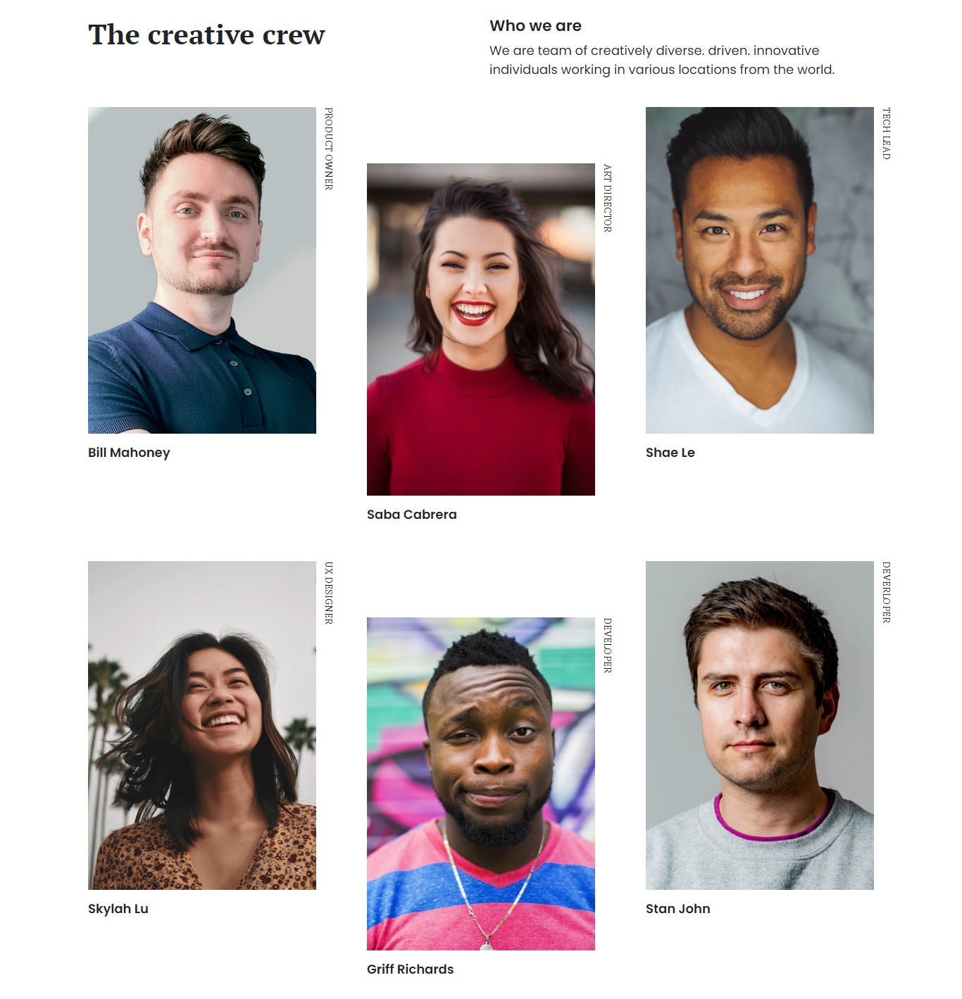

<!-- Please update value in the {}  -->

<h1 align="center">My Team Page</h1>

   Solution for a challenge from  <a href="http://devchallenges.io" target="_blank">Devchallenges.io</a>.

  <h3>
    <a href="https://pagina-del-equipo.netlify.app/">
      Demo
    </a>
     | 
    <a href="https://devchallenges.io/solutions/Hm7hH1BUdUgqGDbaBffs">
      Solution
    </a>
     | 
    <a href="https://devchallenges.io/challenges/hhmesazsqgKXrTkYkt0U">
      Challenge
    </a>
  </h3>

<!-- TABLE OF CONTENTS -->

## Table of Contents

- [Overview](#overview)
- [Built With](#built-with)
- [Contact](#contact)

<!-- OVERVIEW -->

## Overview

In the screenshot you can see the final rusult. This was my first proyect from [DevChallenge](https://devchallenges.io/). I enjoy while I was building it and I practiced while I was building it. It was easy but in the beginning I had some problems. I tried to use Bootstrap to build the grid, but finilly I used CSS grid. I spent less than 3 hours building it.

### Built With

<!-- This section should list any major frameworks that you built your project using. Here are a few examples.-->

- HTML
- Grid
- Flexbox
- [Bootstrap](https://getbootstrap.com/)

## Contact

- Website [Portfolio](https://matiastoso.github.io/)
- GitHub [@matiastoso](https://github.com/matiastoso/)
- Instagram [@matiastoso](https://www.instagram.com/matiastoso/)
